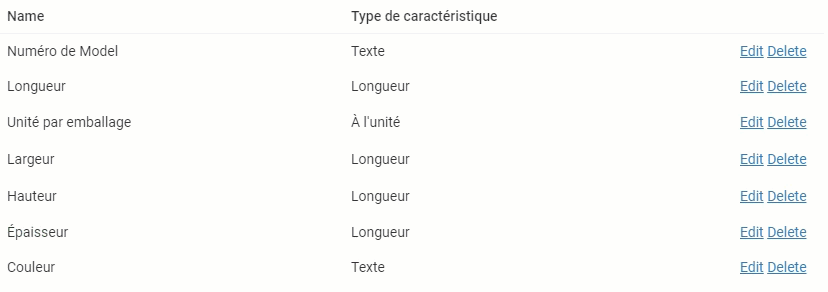
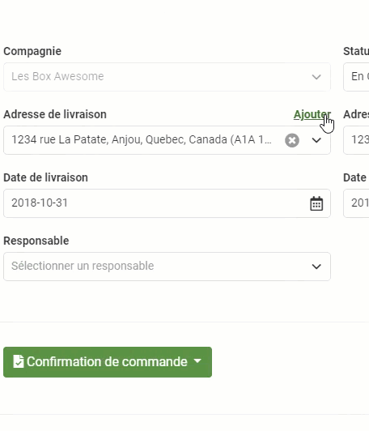
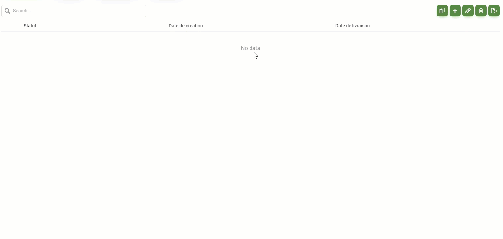

# Octobre

## 04 Octobre

### Résumé des modifications

#### Nouveautés et améliorations {#nouveautes-et-ameliorations}

* Une amélioration des grilles de l'application est en cours dans divers écrans du portail. Il est maintenant possible de modifier et supprimer des items directement depuis la liste.
* Une amélioration de l'expérience utilisateur quant à l'ajout de diverses information connexes est en cours dans divers écrans du portail. Il est maintenant possible d'ajouter une adresse depuis l'écran de commande.
* Il est maintenant possible d'ajouter des frais de types extras ou rabais dans l'écran de commande.
* Il est maintenant possible de modifier les photos à l'aide du _"Glisser-Déposer"_.
* Une amélioration **générale** des performances du portail a été effectuée.
* Les adresses sont maintenant complétées automatiquement **avec l'aide de Google**.
* Il est maintenant possible de sélectionner plusieurs statuts de commande à la fois dans la liste de commandes.

#### **Corrections** {#corrections}

* Correction d'une erreur ne permettant plus à l'utilisateur de créer de nouvelles caractéristiques.
* Correction de divers problème d'affichage dans le portail.
* Correction de divers problème de performance.

### Modification et ajout depuis les grilles

L’élaboration du portail Nex passe avant tout par l’expérience utilisateur. C’est pourquoi nous tentons toujours d’améliorer et de simplifier les interactions lors de l’utilisation des différentes fonctionnalités du portail.

C’est cette vision qui à amener l’équipe de Nex a repensé l’intégration des grilles au sein du portail. L’ajout et la modification d’éléments nécessitants toujours l’affichage de nouveaux écrans ne cadraient pas avec les valeurs prônées par l’équipe. Cette modification permet donc maintenant de modifier, d’ajouter et même de supprimer les données d’une grille sans devoir changer d’écran. Cette fonctionnalité améliore donc grandement la facilité et la rapidité des interactions avec votre portail.

### Ajout rapide d'information connexes

C’est dans la même vision d’amélioration de l’expérience utilisateur que l’équipe a conclu que l’ajout de différents éléments connexe à une fonctionnalité devait être révisé. C’est le cas d’une adresse pouvant être sélectionné dans l’écran de commande. Lors d’un oubli, l’utilisateur devait retourner dans l’écran de compagnie afin d’y ajouter une adresse puis retourner dans l’écran de commande pour la sélectionner. 

Cette nouvelle fonctionnalité permet donc d’ajouter rapidement un élément connexe tel qu’une adresse directement depuis l’écran dans lequel vous vous trouvez. Cette fonctionnalité améliore donc grandement la facilité et la rapidité des interactions avec votre portail.

## 17 octobre

### Résumé des modifications

#### Nouveautés et améliorations

* Il est maintenant possible de voir la liste des changements survenues dans une commande.
* Il est maintenant possible d'ajouter et de modifier votre liste de fournisseurs ainsi que leurs stocks.

#### Corrections

* Correction d'une erreur lors de la création de thèmes avec des accents ou caractères spéciaux.
* Correction des calcules de sommation dans l'écran de commande.
* Correction d'une erreur lors de la désactivation d'un membre de compagnie.
* Correction de divers problème d'affichage dans le portail.
* Correction de divers problème de performance.

### Le sélecteur de colonne

L'expérience utilisateur est une de nos priorité lors de l'élaboration de Nex. C'est ce qui nous permet sans cesse d'améliorer l'utilisation et simplifier la gestion de vos achats, de votre inventaire et de vos ventes. Cette légère amélioration permettra à plusieurs utilisateurs de modifier les différentes colonnes qu'ils afficheront lors de l'ouverture des listes.

Cette simplification permettra donc de voir l'information pertinentes et ce plus rapidement.

