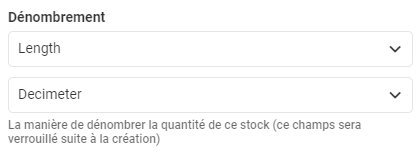
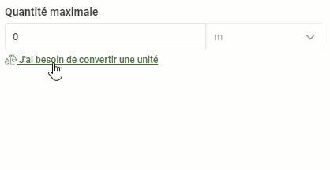

# Septembre

## 11 Septembre

### Résumé des modifications

#### Nouveautés et améliorations

* Il est maintenant possible d'ajouter une agence de taxes dans les paramètres de taxes du portail.
* La gestion des unités de mesure a été révisée afin d'améliorer le fonctionnement des produits et des calculs d'inventaire de Nex.
* Des modifications au tableau de bord ont eu lieu afin de simplifier son utilisation et préparer ce dernier aux nouveaux graphiques plus représentatifs du travail habituel.

#### **Corrections**

* Correction d'une erreur lors de l'ajustement des quantités de produits en inventaire.
* Correction d'une erreur de dénombrement d'utilisateurs au sein du portail dans l'écran d'information.
* Correction d'une erreur causée lors du changement de statuts d'une commande.
* Correction d'une erreur lorsqu'un utilisateur du portail tentait de créer une annonce.

### Gestion des unités de mesure

Lors de **l'élaboration** de la gestion d'unité de mesure dans le portail, l'idée fût de permettre aux utilisateurs de modifier les unités à leur guise sans qu'il n'y ai de configuration spécifique. C'est-à-dire qu'un utilisateur de Nex était en mesure de changer les unités affichées de _millimètres_ à _pouces._

**Le problème** de cette approche fut relié aux prix des produits dans Nex. En effet, plusieurs conversions devenaient problématiques lors du calcul de ces derniers. Il était par exemple possible de diminuer le prix d'une facture de quelques dollars en modifiant les unités de commandes en se basant sur l'unité du prix du produit.

La solution fut d'introduire l'unité de base d'un produit. Cette unité est utilisée dans tous le portail en tant qu'unité qui prévaut pour tout les calculs. Elle est entrée dans l'écran de chaque produit.

De plus, afin de faciliter l'entrée de données, nous avons créé un tout nouvel outil sur tous les champs numériques comprenant des unités de mesure. Cet outil permet de convertir n'importe quelles unités vers l'unité de base d'un produit. Pour ce faire, il suffit de cliquer sur l'option "_j'ai besoin de convertir une unité"_ sous le champ numérique.

## 01 Septembre

### Résumé des modifications

#### Nouveautés et améliorations

*  Un nouvel écran d’erreurs a été créé afin de simplifier le processus de report de celles-ci.
* Un écran de transition de statuts de commandes a été ajouté dans les paramètres.
* Il est maintenant possible d’ajouter un numéro de téléphone aux utilisateurs ainsi qu’aux membres de compagnies.
* La gestion des caractéristiques de Nex a été revue afin de permettre de créer des catégories ainsi que d’ordonner celles-ci.
* Il est maintenant possible d’ajouter des membres à une compagnie lors de la création de celle-ci.
* Une révision des différents textes de l’application a été effectuée afin d’uniformiser ceux-ci.

#### Corrections

*  Il n'est maintenant plus possible pour les administrateurs de voir les mots de passe générés automatiquement.
* L’icône d’export des grilles du portail devrait maintenant être affichée correctement.
* La clique multiple d’un groupe de données ne devrait plus causer d’erreur.

