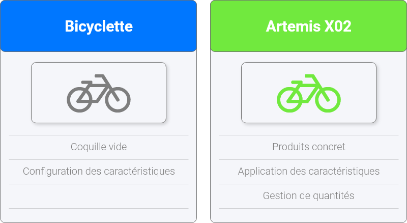
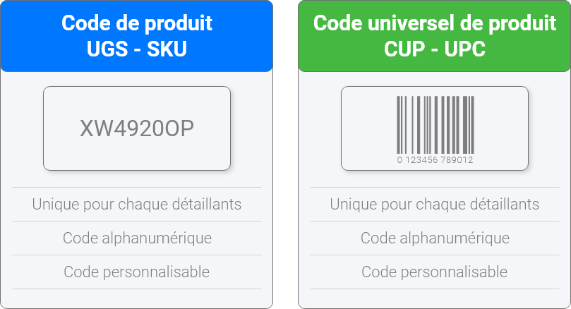

# Inventaire

## La gestion de produits

Le portail Nex à pour but de vous permettre de maintenanir votre inventaire adéquatements et facilements. Pour ce faire, il a été spécialement conçu pour s'adapter à vos produits à l'aide des configuration de produits et des caractéristiques de celles-ci. De plus, Nex offre la possibilité de tracabilité de produit. Cette fonctionnalité permet de voir l'historique du mouvement de quantité de chancun de vos produit.

### Configuration de produits

La fonctionnalité de configuration de produit permet de créer une coquille vide ayant les caractéristiques requises pour un produit ou, plus souvent, un groupe de produits. Un nom ainsi qu'une brève description peuvent être appliquer à la configuration. Ensuite, vous pouvez sélectionner les différentes caractéristiques de votre coquille de produit. Celles-ci apparaîterons par la suite dans l'écran de produit et devrons être remplises correctement.

### Transaction de produits

### Les codes de produits

Dans le portail Nex, il existe deux façons différentes d'ajouter un code à vos produits : Le **SKU** et le **UPC**. Bien que plusieurs personne interchange les deux termes leur signification diffères grandement. C'est pourquoi dans le portail Nex il est possible d'entrer les deux valeurs séparément.

#### L'unité de gestion des stocks \(SKU\)

L'unité de gestion des stocks \(UGS\) de l'anglais _\(Stock keeping unit - SKU\)_ s'agit d'une unité de mesure utilisée en gestion des stocks. Elle désigne une référence élémentaire \(par exemple une marque ou un modèle\), à un niveau suffisamment déterminé pour servir à la gestion précise des volumes disponibles.

> Bien qu'aucune standardisation n'existe pour les codes UGS ils sont généralement désignés par un code alphanumérique.

#### Le code universel de produit \(UPC\)

Le code universel des produits CUP de l'anglais \(Universal Product Code - UPC\) est un système d'identification numérique globalement utilisé aux États-Unis et au Canada. Ce code est généralement utilisé pour les articles destinés à la vente en magasin. Il est encodé sous la forme de code-barres afin de permettre sa lecture par un lecteur optique dans les commerces.

> Une standardisation est nécessaire pour tous code CUP qui sont toujours des codes numérique seulement.

## Contrôle d'inventaire

Le contrôle d'inventaire, est utilisé dans le but de faire un suivis de la quantité de produits que vous possédez à tout moment ainsi que d'effectuer toute traçabilité. Stock control, also known as inventory control, is used to show how much stock you have at any one time, and how you keep track of it. It applies to every item you use to produce a product or service, from **raw materials** to **finished goods**. It covers stock at every stage of the production process, from **purchase** and **delivery** to **using** and **re-ordering** the stock.



## Variantes

Variants are different version of the same product. They ease the creation of products that keep the same characteristics with minor changes. A good example would be the production of clothes. The design and material is the same, but the color or the size could change.

The pricing of variant is important. A variant can be priced directly within the stock screen or use the price of the parent product. The user should always be able to determine if a variant have it's own price or if the price comes from the parent.



## Assemblage est composites

\[Complete description\]

## Gestion des prix

\[COMPLETE DESCRIPTION HERE\]

* The price of a product is done within the stock screen.
* The price can differ based on variant.
* We should categorize clients based on volume.
* We should be able to price a product for a specific client.

## Gestion des coûts

Each stock can have their own cost according to the price they are bought for. The system offers three different ways of handling costs within the stock. Each of the cost variables are stored with dates of changes so the user can track back costs. The system also keep tracks of them and help the users take decisions based on those costs fluctuations.

The first one being the average cost of the item that determine what should be the cost of a specific cost when a buyer purchase it in average this cost is either manually entered or taken from all the purchase orders of the stock.

The last cost is the cost of the item for the latest purchase order. This cost help the buyer predict what would be a good or not good cost for the product when buying it. It also provide a way of determining if the current cost of a purchase order is too expensive.

\[REVISED THIS\] The next cost is a calculated cost based on all the fees and the real cost that was charged to the company when it received the last stock.

## Mouvement d'inventaire

## Warehouse and Localization

Warehouse are used to determine a place where stocks are being held. These allow the administrators and managers to keep inventory quantities above a certain threashold at each places and manage their point of sales with a better consistancy.

A stock could have quantities in multiple warehouse and localization.

### Localization

The localization are places within a warehouse such as shelf, boxes, yards, silo, etc.

## Processus automatique

\[Complete description\]

