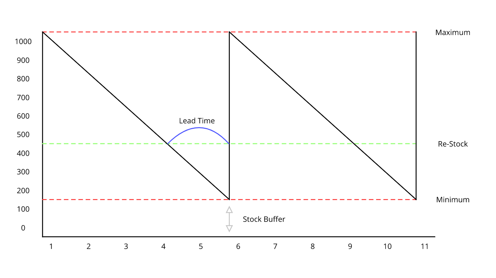
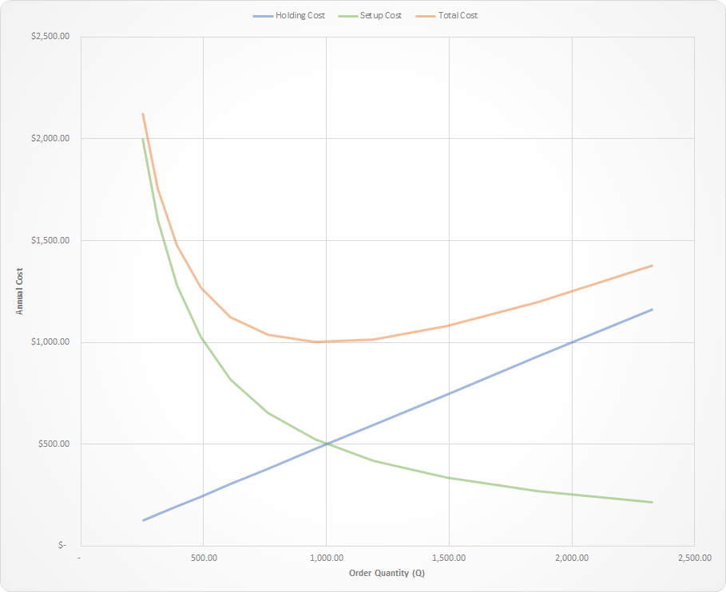

# Contrôle des stocks

## Stock Control

Stock control, also known as inventory control, is used to show how much stock you have at any one time, and how you keep track of it. It applies to every item you use to produce a product or service, from **raw materials** to **finished goods**. It covers stock at every stage of the production process, from **purchase** and **delivery** to **using** and **re-ordering** the stock.

Efficient stock control allows you to have the right amount of stock in the right place at the right time. It ensures that capital is not tied up unnecessarily, and protects production if problems arise with the supply chain

### Types of stock

There are four main types of stock:

* Raw materials and components:  Stocks that are ready to use in production.
* Work in progress: Stocks of unfinished goods in production _\(Follows production statuses\)_.
* Finished goods: Stocks that are ready for sale.
* Consumables: Everything that is not a stock but is included in the process _\(i.e: fuel\)_.

### Stock Control Variables

* Maximum Level: Determine the maixmum level of stock your business can or want to hold.
* Minimum Level: Determine the minimum level of stock the business should always have.
* Re-stock Level: Determine the trigger point where the stocks need to be re-ordered.
* Lead Time: Determine the amount of time it takes between placing an order and receiving the stock.
* Stock Buffer: Determine the amount of stock the business always hold _\(Minimum - 0\)_.

Categorizing the stock could help controlling the quantities. For example, having a **Low**, **Medium** and **High** level of importance could lead to different set of variables. You might want to re-order the high priority stock first. If your stock levels are limited by capital, this will help you to plan expenses on new and replacement stock.



### Low stock level

_Advantages_

* Lower stock holding costs.
* Lower risk of obsolescence.
* Less capital _\(cash\)_ tied up in working capital.
* Consistent with _"Lead"_ operations.
* Efficiency and flexibility, you only have what you need.
* Easier way of keeping up-to-date without waste.

_Disadvantages_

* Harder to meet needs, stock could become expensive and complicated.
* You might run out of stock.
* You are dependent on your supplier's efficiency _\(Lead Time\)_.

Suit business where:

* It is a fast moving environment where products develop rapidly
* The stock is expensive to buy and store.
* Replenishin the stock is easy and quick.

### High stock level

_Advantages_

* Easy to manage.
* Low management cost.
* You never run out of stock.
* Buying larger amount of stock can be cheaper.

_Disadvantages_

* Higher storage and insurance cost.
* Certain good might perish.
* Stock may become obsolete before used.
* Capital is tied up.

Suit business where:

* Sales are difficult to predict _\(and it is hard to pin down how much stock you need\)_.
* You can store plenty of stock cheaply.
* The components or materials are unlikely to go trough rapid developments.
* The components or materials take a long time to resuply _\(Lead Time\)_.

### Factor Affecting Re-Stock

* How long it takes for your supplied to deliver _\(Lead Time\)_.
* What are the implication of running out of stock.
* The demands for your product.

## Stock Control: Methods

There are several ways of controling the stock in your business. They are all designed to provide an efficient way for deciding when and how much to order. You could be using one, multiple of even a mixture of multiple methods. The type of stocks used and finished good produced by your business will help determine which one is the best for **you**.

### Methods

#### Minimum Stock Level

You determine a minimum stock level and you or the system you are using re-order the stock whenever this limit is reached. This limit is also known as _"Re-Order or Reorder Point \(ROP\)"_ level.

#### Stock Review

Every period, you review the current stock you have and place an order according to the stock you might need for the next period.

#### Just In Time \(JIT\)

This aims to reduce costs by placing order for stock when stocks is needed. It cuts stock to a minimum quantity level, but there is a risk of running out of stock. Therefore, you need to be confident that your suppliers can deliver on demand.

**These methods can be used alongside other processes to refine the stock control.**

* Re-Order Lead Time: Allows for time between placing an order and receiving it.
* Economic Order Quantity _\(EOQ\)_: This is a standard process formula that helps you define what is the best stock quantity you should be holding based on different costs.
* Batch Control: Managing the production within batches. You will need to make sure you have enough stock to cover each batch of orders. Then order another batch of stocks from the supplier. This is done each period and is useful when you can predict the amount of stock you used and your supplier are reliable.
* First in First out _\(FIFO\)_: Process where the first stock that came in is used first. This is to avoid persishment of stock. Stock is normally identified with a date or stored in a way where the oldest stock is used first.

### Economic Order Quantity

I wanted to make a quick reference to this method's process. The complexity of it can be reduced by using computer software such as Excel. There are multiple variable and assumption taken into consideration for this formula. Please refer to the graph example for more information.

```text
D: Demand of unit per period (i.e a year).
Q: Quantity ordered based on demand.
S: Setup or supplying cost per unit per order (i.e Shipping, Supplier fees, etc.).
H: Holding cost per unit per year.

Total Cost (TC) is calculated this way
TC = (D/Q) * S + (Q/2) * H
```

There are variant of this process such as _POQ_ which we might want to cover in extra documentations.



## Stock Control Systems: Manual

Stocktaking involve making an inventory and noting the location of each stock every year. It is an necessary exercise that takes a long time to do. There are some way to ease this process: checking the inventory more often, using the rolling inventory process, using **barcodes** or **RFID**. You could also use specialized software _\(covered in the next topic\)_. Despite all those process, you will always need the following:

* Tracking the stock level.
* Make orders _\(supplier\)_.
* Issue stocks.

The simplest manual system is the **stock book** which suits small businesses. It allows you to keep a log of all the stocks received and issued. When more complex information are needed, **stock cards** are usually used. They allow to track information such as description, value, location, supplier details, etc.

## Stock Control System: Software

The computer software used for tracking inventory uses similar principles as the manual tracking. However, they tend to ease the process of entering, tracking and keeping information for each stock you have. They also provide multiple reports that helps you take decisions.

These software enables multiple features that helps along the process. Here are some of them:

* Integration with other systems such as accounting and invoicing _\(You only have to input data once\)_.
* Automation processes such as re-ordering and monitoring.
* Helps identify the cheapest and fastest supplier _\(Manage the impact on lead time\)_.
* Bar coding or radio frequency systems which speed up processing and recording.

> ### How to choose the right software
>
> There are many software systems available. Talk to others in your line of business about the software they use, or contact your trade association for advice.
>
> Make a checklist of your requirements. For example, your needs might include:
>
> * multiple prices for items
> * prices in different currencies
> * automatic updating, selecting groups of items to update, single-item updating
> * using more than one warehouse
> * ability to adapt to your changing needs
> * quality control and batch tracking
> * integration with other packages
> * multiple users at the same time
> * Avoid choosing software that's too complicated for your needs as it will be a waste of time and money.
>
> [Source of information](http://www.infoentrepreneurs.org/en/guides/stock-control-and-inventory/)

