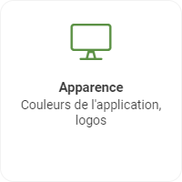
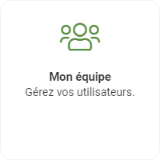

# Configurer votre portail!

**Bienvenue !** Vous êtes au bon endroit si vous cherchez à en apprendre davantage sur l’utilisation de Nex. 

Le portail Nex est le moyen le plus **efficace** pour vous et votre entreprise de simplifier votre processus d’affaire et vous permettre d’atteindre et même de **dépasser vos objectifs**. Cet article vous aidera à progresser dans le portail afin que vous puissiez établir les _bases nécessaires pour un lancement rapide_.

De la **configuration** de votre compagnie au sein de votre portail jusqu'à l’**ajout de produits** destiné à optimiser votre inventaire, le guide des premiers pas est là! La configuration de votre portail débute donc dans les _paramètres_ de ce dernier.


L'option **paramètres** du menu de gauche.


C’est à cette endroit que vous aurez accès à toutes les configurations possibles de votre portail. Dans ce guide de premiers pas, nous nous intéresserons principalement aux paramètres suivants : _Informations_; _Apparence_; _Catégories de stock_ et _Mon équipe_.

## Informations relatives à votre entreprise

Afin de débuter de la meilleure façons qu'il soit, vous devrez entrer les informations relatives à votre entreprise. 

Vous trouverez ici les informations relatives à votre entreprise tels que votre site web, vos adresses, vos coordonnées téléphoniques ainsi que votre logo. De plus, il vous est possible de voir le nombre d’utilisateurs de votre portail ainsi que le numéro de version. 

Les informations relatives à votre entreprises sont primordiale dans le portail. Elles seront utilisés automatiquement tout au long de votre processus d'affaire. _Par example, lors de la création de commande afin de déterminer d'où proviennent les produits._

Commencez par entrer les informations relatives à votre entreprise puis, retourner dans paramètres.

## Le bleu c'est bien, mais j'aimerais changer!

C'est là que le menu d'apparence entre en jeu. Le portail Nex est conçu pour s'adapter à votre entreprise et non le contraire. L'adaptation comment donc par une mise à niveau de vos couleurs.

Vous pourrez depuis cette écran créer différentes variantes de couleurs que nous appellerons _thèmes_. Ces thèmes ont trois différentes couleurs ainsi qu'un image associé qui remplace le logo principale de votre entreprise.


Prenez note que si aucun logo n'est ajouté à votre thème, le logo de votre entreprise sera utilisé par défaut.


## Un c'est bien, mais deux ces mieux.

Il est maintenant temps de **collaborer** avec votre équipe. Que votre entreprise compte deux ou mille personnes, votre portail est prêt pour vous. Vous pourrez gérer les différents **rôle** de chacun des membres de votre équipe ainsi que leur **information pertinente** au bon fonctionnement de votre processus.

Depuis cette écran, il vous sera possible d'entrer diverses information relative au membre de l'équipe tels que son _nom_, _prénom_, sa _préférence linguistique_ ainsi qu'un _portrait_. De plus, il est possible de déterminer le _rôle_ de ce dernier parmi les rôles disponibles.


Chaque rôle donne accès à différentes section du portail. Il est important de prendre soin de bien lire les accès des différents rôle.




